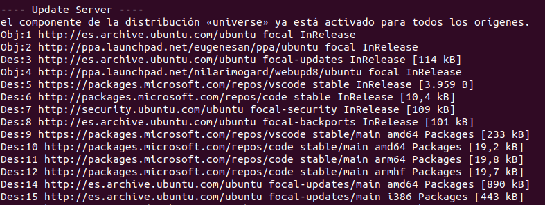
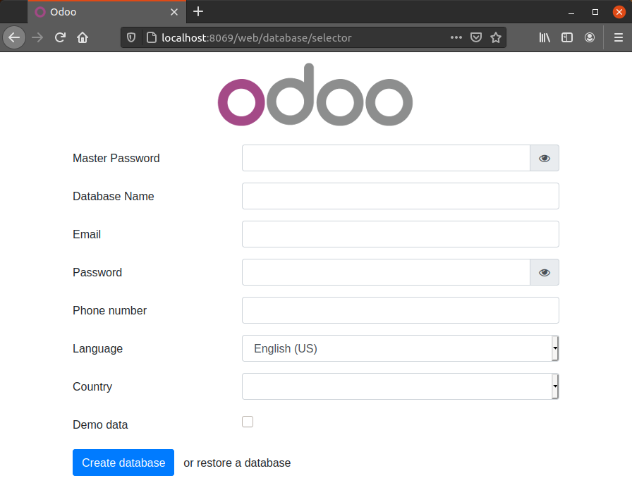

# Introducción

Vamos a aprender a instalar Odoo 14 Community Edition.

Para ello vamos a usar un script que automatiza y facilita la instalación.

## Paso 1

Descargar el script. 

Para ello nos movemos al directorio donde queremos que se descargue el script.

```bash
cd \
```

Descargamos el script con el comando `wget`

```bash
sudo wget https://raw.githubusercontent.com/Yenthe666/InstallScript/14.0/odoo_install.sh
```

## Paso 2

Hay algunos parametros en este script que debemos cambiar/configurar, para ello lo editamos.

```bash
sudo nano odoo_install.sh
```

Puede indicar que versión de Odoo quieres instalar, su ubicación, usuario, si quieres instalar Wkhtmltopdf, y los más importante, cuál es la contraseña de admin.

```bash
OE_USER="odoo"
OE_HOME="/$OE_USER"
OE_HOME_EXT="/$OE_USER/${OE_USER}-server"
# The default port where this Odoo instance will run under (provided you use the command -c in the terminal)
# Set to true if you want to install it, false if you don't need it or have it already installed.
INSTALL_WKHTMLTOPDF="False"
# Set the default Odoo port (you still have to use -c /etc/odoo-server.conf for example to use this.)
OE_PORT="8069"
# Choose the Odoo version which you want to install. For example: 13.0, 12.0, 11.0 or saas-18. When using 'master' the master version will be installed.
# IMPORTANT! This script contains extra libraries that are specifically needed for Odoo 13.0
OE_VERSION="14.0"
# Set this to True if you want to install the Odoo enterprise version!
IS_ENTERPRISE="False"
# Set this to True if you want to install Nginx!
INSTALL_NGINX="False"
# Set the superadmin password - if GENERATE_RANDOM_PASSWORD is set to "True" we will automatically generate a random password, otherwise we use this one
OE_SUPERADMIN="admin"
# Set to "True" to generate a random password, "False" to use the variable in OE_SUPERADMIN
GENERATE_RANDOM_PASSWORD="True"
OE_CONFIG="${OE_USER}-server"
# Set the website name
WEBSITE_NAME="_"
# Set the default Odoo longpolling port (you still have to use -c /etc/odoo-server.conf for example to use this.)
LONGPOLLING_PORT="8072"
# Set to "True" to install certbot and have ssl enabled, "False" to use http
ENABLE_SSL="True"
# Provide Email to register ssl certificate
ADMIN_EMAIL="odoo@example.com"
```

Si deseas instarlar la edición Enterprise, recuerda establecer la variable `IS_ENTERPRISE` a `True`.

Tras hacer los cambios, `Guarda (ctrl+o)` y `Cierra (ctrl+x)` el editor.

Para finalizar damos permisos de ejecución al script.

```bash
sudo chmod +x odoo_install.sh
```

## Paso 3

Ejecutamos el script.

```bash
./odoo_install.sh
```

Comprobamos que nos aparece en la consola los pasos que se van ejecuntando, instalación de actualizaciones, descarga de paquetes, creación de usuarios, descarga del código desde github, ...

 NOTA: :bulb: Si instalas la versión Enterprise, tienes que proporcionar tus credenciales de Github ya que es un repositorio de acceso restringido.



Al finalizar, nos informa del resultado:

```
-----------------------------------------------------------
Done! The Odoo server is up and running. Specifications:
Port: 8069
User service: odoo14
Configuraton file location: /etc/odoo14-server.conf
Logfile location: /var/log/odoo14
User PostgreSQL: odoo14
Code location: odoo14
Addons folder: odoo14/odoo14-server/addons/
Password superadmin (database): ****************
Start Odoo service: sudo service odoo14-server start
Stop Odoo service: sudo service odoo14-server stop
Restart Odoo service: sudo service odoo14-server restart
-----------------------------------------------------------
```

Ahora podemos ir al navegador y ejecutar http://localhost:8069/



## Algunas anotaciones finales

* Ejecutar PostgreSQL: `pg_ctlcluster 12 main start`
* Iniciar Odoo service: `sudo service odoo14-server start`.
* Parar Odoo service: `sudo service odoo14-server stop`. 
* Reiniciar Odoo service: `sudo service odoo14-server restart`.
